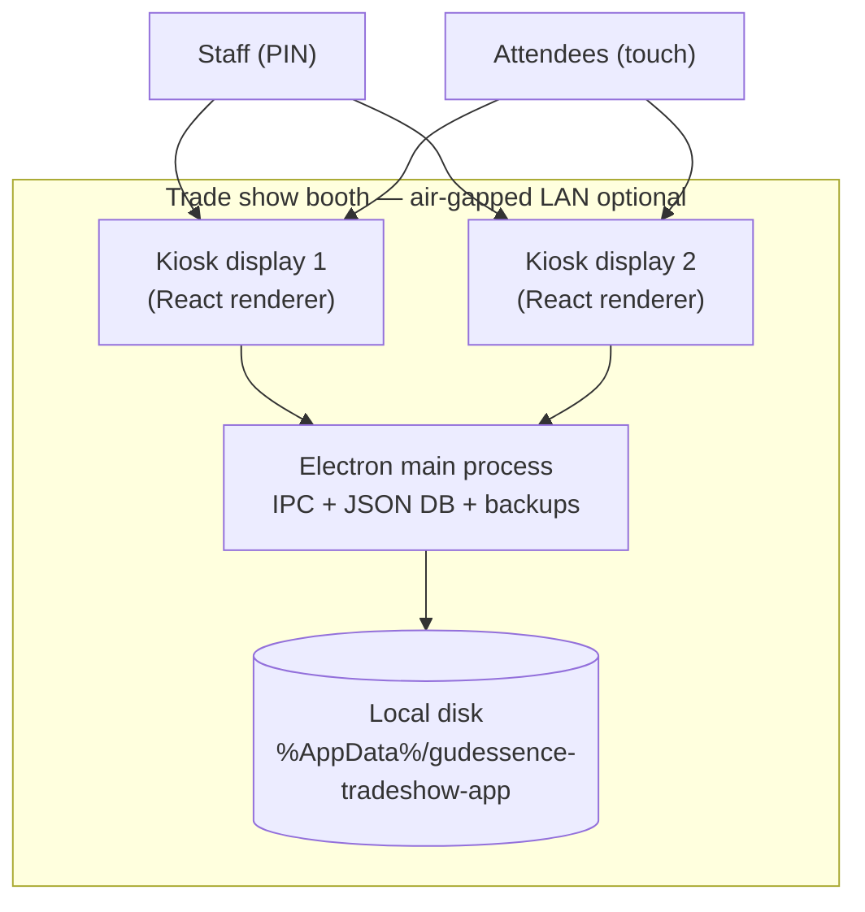
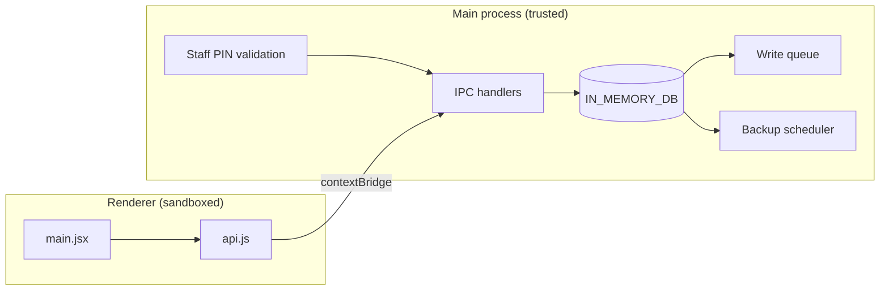
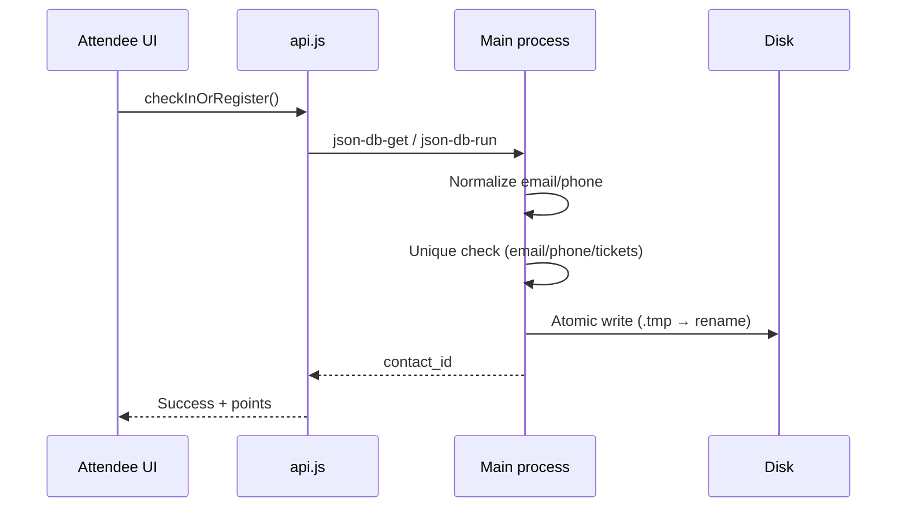

# Architecture

## Overview

The GŪDESSENCE Tradeshow App is an **offline-first, dual-monitor Electron kiosk** for lead capture, engagement points, VIP perks, and raffle management at live events. All attendee data is stored **locally on the kiosk PC** as JSON files; there is no cloud database or API in the default deployment.

## Technology stack

| Layer | Technology |
|-------|------------|
| Desktop shell | Electron 41 |
| UI | React 19 + Vite 8 |
| Persistence | JSON files (in-memory cache + atomic disk writes) |
| Audio | Howler |
| Packaging | electron-builder (Windows NSIS) |

> **Note:** Early product docs referenced SQLite. The shipped implementation uses a multi-file JSON store merged at startup. See [Data model](#data-model).

## System context

## Process architecture

### Security boundaries

- **contextIsolation: true**, **nodeIntegration: false** in renderer.
- Only `preload.js` exposes a fixed `electronAPI` surface.
- Writable collections are allow-listed in `json-db-run` (`EDITABLE_COLLECTIONS`).
- Staff PINs are validated in the **main process**; PINs are not shipped in the UI bundle.

## Data model

Physical files (under Electron `userData` in production):

| File | Collections |
|------|-------------|
| `DB_Attendees.json` | `Contacts` |
| `DB_Settings.json` | `Actions`, `Giveaways` |
| `DB_Engagement.json` | `UserActions`, `GiveawayEntries`, `Votes`, `SupportTickets` |
| `StaffLogs.json` | Array of audit log entries |
| `staff.roster.json` | Staff names + PINs (not in git) |

### Startup merge priority (low → high)

1. Bundled `src/*.json` (seed / defaults)
2. Latest folder in `src/backups/` (dev) or project backups
3. `%AppData%\gudessence-tradeshow-app\` (authoritative at runtime)

## Data flow — attendee check-in

## Backup subsystem

- Interval: **5 minutes** (`setInterval` 300000 ms)
- Format: gzip-compressed full DB snapshot (`backup-<timestamp>.json.gz`)
- Locations: `userData/backups/` (primary) and `src/backups/` (secondary, dev)
- Retention: files older than **7 days** deleted automatically

## Dual-kiosk behavior

- One `BrowserWindow` per connected display (`screen.getAllDisplays()`).
- Each window gets a `source_kiosk` label (`Kiosk 1`, `Kiosk 2`) on writes.
- Session storage is cleared on boot; per-kiosk `localStorage` keys isolate attendee sessions.

## Build artifacts

| Command | Output |
|---------|--------|
| `npm run dev` | Vite dev server + Electron |
| `npm run build` | `dist/`, `dist-electron/` |
| `npm run build:win` | `release/*.exe` (NSIS installer) |

## Related documents

- [Security](./security.md)
- [Network & infrastructure](./network-infrastructure.md)
- [Deployment](./deployment.md)
