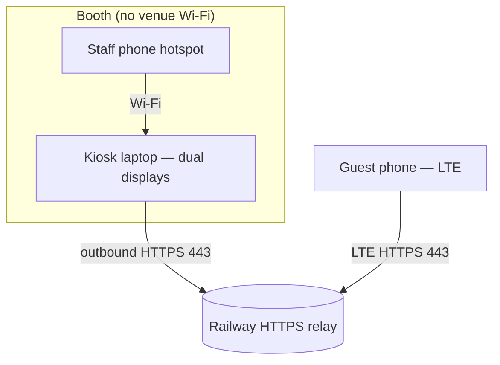

# Hotspot show setup — no venue Wi‑Fi (Option A)

**Recommended production setup** when the venue has **no Wi‑Fi**: run the kiosk laptop off a **staff phone hotspot**, with a **permanent cloud relay** (Railway) so guest phones on **LTE** can sign up without sharing any network with the booth.

## Architecture



| Device | Network | Talks to |
|--------|---------|----------|
| Kiosk laptop | Staff phone **hotspot** (Wi‑Fi) | Railway relay (sync pending signups) |
| Guest phones | **LTE** or any Wi‑Fi | Same Railway relay (QR signup form) |
| Staff phones | LTE or any Wi‑Fi | Railway staff monitor URL (optional approve) |

**Important:** Guest phones never connect to the hotspot. They only need cell data. The cloud relay is the meeting point.

---

## One-time setup (before the event)

### Phase 1 — Deploy Railway relay (~15 min)

| Step | Action |
|------|--------|
| 1 | Generate secrets (save in password manager): `openssl rand -hex 32` → `RELAY_API_KEY`; pick `STAFF_MONITOR_PIN` (e.g. 4-digit code for staff phones only) |
| 2 | Push repo to GitHub/GitLab |
| 3 | [railway.app](https://railway.app) → **New Project** → **Deploy from GitHub repo** |
| 4 | Service settings → **Root Directory**: `gudessence-tradeshow-app/server/signup-relay` |
| 5 | **Variables** tab → add `RELAY_API_KEY`, `STAFF_MONITOR_PIN` (Railway sets `PORT` automatically) |
| 6 | **Settings** → generate **Public Domain** → copy HTTPS URL (e.g. `https://gudessence-relay-production.up.railway.app`) |
| 7 | Verify: `curl https://YOUR_URL/health` → `{"ok":true,"service":"gudessence-signup-relay"}` |

See [railway-deploy.md](./railway-deploy.md) for screenshots-level detail.

### Phase 2 — Kiosk config

Copy [config/signup-sync.production.example.json](../config/signup-sync.production.example.json) to the kiosk:

**Windows (show PC):** `%AppData%\gudessence-tradeshow-app\signup-sync.json`

Replace `YOUR_RAILWAY_HOST` and `RELAY_API_KEY` with values from Phase 1.

Validate before packing:

```bash
npm run validate:show
```

### Phase 3 — Build kiosk app

```bash
cd gudessence-tradeshow-app
npm install
npm run build:win
```

Install from `release/` on the show laptop.

### Phase 4 — Hotspot rehearsal (do this at home)

| Step | Action |
|------|--------|
| 1 | Enable hotspot on **dedicated staff phone** (unlimited/high data plan) |
| 2 | Connect **only the kiosk laptop** to that hotspot |
| 3 | Confirm laptop has internet (open Railway `/health` in browser) |
| 4 | Launch kiosk app → **🟢 HTTPS sync live — any network** |
| 5 | On a **second phone with LTE** (not on hotspot), scan QR → submit |
| 6 | Pending card on kiosk within ~4s → Approve |

---

## Show morning checklist (no venue Wi‑Fi)

| ☐ | Task |
|---|------|
| ☐ | Staff hotspot phone: **fully charged** + charger at booth |
| ☐ | Hotspot **on** before launching app |
| ☐ | Kiosk laptop connected to **staff hotspot only** (disable other Wi‑Fi) |
| ☐ | `signup-sync.json` on kiosk points to **Railway HTTPS** (not `127.0.0.1`) |
| ☐ | Launch app → sync green |
| ☐ | LTE test signup + approve |
| ☐ | Staff phones bookmark `publicStaffUrl` + know `STAFF_MONITOR_PIN` |
| ☐ | Both touch displays connected (extended desktop) |

---

## Best practices

### Staff hotspot phone

- Use a **dedicated** phone — not the one staff use for personal calls during rush
- **Unlimited or large data** plan; kiosk sync is lightweight (~poll every 4s)
- Keep phone **plugged in** all night
- Set hotspot **SSID/password** once; save on kiosk laptop
- Place phone where it gets **good cell signal** (not inside a metal booth cabinet)

### Kiosk laptop

- **Outbound HTTPS (443) only** — no inbound ports
- Disable auto-connect to random venue networks
- Run **built `.exe`** in production, not `npm run dev`
- Do **not** use cloudflared/ngrok on show day — URL changes; Railway URL is stable

### If sync goes red mid-show

1. Check hotspot phone still has LTE signal and hotspot enabled
2. Open Railway URL `/health` on kiosk browser
3. Verify hotspot data not exhausted
4. Restart app (data is local — safe to relaunch)

### If hotspot fails completely

- Core kiosk features still work **offline** (check-in at display, points, VIP)
- Mobile QR queue **pauses** until internet returns
- Fallback: manual check-in at kiosk only

---

## Dev vs show day

| | Dev (`npm run dev`) | Show day (hotspot + Railway) |
|--|---------------------|------------------------------|
| Relay | Local `:8787` auto-started | Railway HTTPS |
| Phone QR URL | cloudflared/ngrok tunnel OR LAN | Railway URL in `signup-sync.json` |
| Kiosk internet | Any | Staff phone hotspot |
| Config file | `config/signup-sync.dev.json` | `%AppData%/signup-sync.json` production |

---

## Related docs

- [Railway deploy guide](./railway-deploy.md)
- [Show-day setup](./show-day-setup.md)
- [Network infrastructure](./network-infrastructure.md)
- [Runbook — incidents](./runbook.md)
