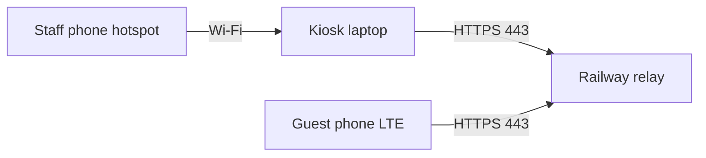

# Network & infrastructure

## Deployment model: offline-first + optional cloud sync

Core kiosk features (registration at display, points, VIP, raffle, backups) run **without internet**. Mobile QR signups require **outbound HTTPS** to the cloud relay only.

### Show-day without venue Wi‑Fi (recommended — Option A)

Use a **staff phone hotspot** for the kiosk laptop + **Railway HTTPS relay** for guest phones on LTE.

→ Full guide: [Hotspot show setup](./hotspot-show-setup.md)



| Device | Network | Required? |
|--------|---------|-----------|
| Kiosk laptop | Staff hotspot Wi‑Fi | Yes (for QR sync) |
| Guest phones | LTE or any Wi‑Fi | No booth network needed |
| Venue Wi‑Fi | — | **Not required** |

## Recommended network posture

| Scenario | Recommendation |
|----------|----------------|
| Show floor — **no venue Wi‑Fi** | Staff phone hotspot → kiosk; Railway relay for LTE guests — [hotspot guide](./hotspot-show-setup.md) |
| Show floor — venue Wi‑Fi available | Kiosk on guest Wi‑Fi or hotspot; same Railway relay |
| Dev / staging | `npm run dev` with local relay + cloudflared tunnel, or point at Railway |
| Post-event data export | USB drive or approved secure file transfer — not email |

### Firewall (if kiosk stays online)

Allow only what IT explicitly needs:

| Direction | Port | Purpose | Required? |
|-----------|------|---------|-----------|
| Outbound | 443 | Mobile QR HTTPS relay (required) | **Yes** |
| Outbound | 443 | Windows Update, GitLab | Optional |
| Outbound | 53 | DNS | When online |
| Inbound | — | **Deny all** to kiosk | **Deny** |

Phones and kiosks communicate via the **public HTTPS signup relay** — not direct LAN to the kiosk PC.

See [Show-day setup](./show-day-setup.md) for mobile QR workflow.

## Hardware specification (reference)

| Component | Guidance |
|-----------|----------|
| OS | Windows 10/11 64-bit |
| Displays | 2× touch monitors (extended desktop) |
| RAM | 8 GB minimum |
| Storage | 50 GB+ free for backups |
| USB | Keyboard for IT setup only (remove or hide for show) |

## GitLab (source control)

| Item | Value |
|------|-------|
| Host | `https://gitlab.gudessence.dev` |
| Internal group | Namespace ID `10` (see GitLab group settings) |
| CI | `.gitlab-ci.yml` — install, audit, build |

Clone (after project is created):

```bash
git clone https://gitlab.gudessence.dev/<group>/gudessence-tradeshow-app.git
```

Use deploy keys or personal access tokens per org policy — never commit tokens.

## DNS and TLS

Not applicable at runtime. GitLab clone/build uses TLS to `gitlab.gudessence.dev` when updating software.

## Monitoring

No central telemetry is built in. Operational signals are local:

- Staff Dashboard: backup time, backup size, data health
- `StaffLogs.json` audit trail
- Windows Event Viewer for OS-level issues

## Disaster recovery

| Failure | Recovery |
|---------|----------|
| App crash | Relaunch; data persisted in userData |
| Corrupt JSON | Restore latest `backup-*.json.gz` from `backups/` |
| Lost PC | Restore from USB copy of backups taken at end of day |
| Wrong monitor mapping | Swap display cables; see [Runbook](./runbook.md) |
