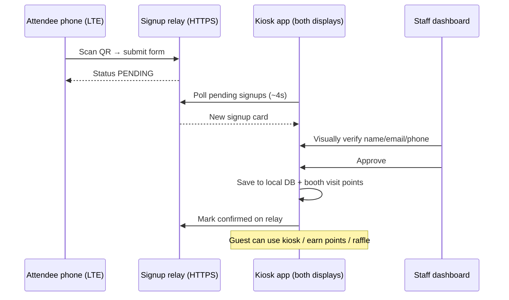

# Show-day setup — Cannadelic mobile QR signups

Use this checklist before **Cannadelic Night Market** (e.g. June 06, 2026) when running **dual kiosks** with **phone signups over LTE**.

## Workflow (end-to-end)



1. **Guest scans QR** on Check-In page (works on **LTE or any Wi‑Fi**).
2. **Guest fills out** first name, email and/or phone on the mobile page.
3. **Status = PENDING** on phone and on kiosk within ~4 seconds.
4. **Staff opens Staff Dashboard** (or Check-In panel) and sees the pending card.
5. **Staff visually verifies** the guest matches the submitted info.
6. **Staff taps Approve** → contact is **saved locally**, booth visit points applied, audit log written.
7. Guest is in the system for points, giveaway entries, VIP, etc. (add physical tickets at kiosk if needed).

---

## Pre-show (IT / dev) — one-time

### 1. Deploy the cloud signup relay

```bash
cd gudessence-tradeshow-app/server/signup-relay
npm install
export RELAY_API_KEY="$(openssl rand -hex 32)"
export STAFF_MONITOR_PIN="your-staff-phone-pin"   # staff enter this on phone monitor to approve
export PORT=8787
npm start
```

Put **HTTPS** in front (Railway, Render, internal VPS, nginx + Let's Encrypt, etc.).

Verify:

```bash
curl https://YOUR_RELAY_HOST/health
# → {"ok":true,"service":"gudessence-signup-relay"}
```

Mobile page (QR target):

`https://YOUR_RELAY_HOST/signup/cannadelic-2026-06-06?title=Cannadelic%20Night%20Market`

### 2. Configure each kiosk PC

Copy the example and edit with your relay URL and **same API key** as `RELAY_API_KEY`:

**Production path (preferred):**

`%AppData%\gudessence-tradeshow-app\signup-sync.json`

**Dev path (optional):**

`gudessence-tradeshow-app/config/signup-sync.json`

Copy the dev template if missing:

```bash
cp config/signup-sync.dev.json config/signup-sync.json
```

On first launch with no config, the app auto-creates one in AppData from `signup-sync.dev.json`.

```json
{
  "eventId": "cannadelic-2026-06-06",
  "relayApiUrl": "https://YOUR_RELAY_HOST",
  "relayApiKey": "SAME_AS_RELAY_API_KEY",
  "publicSignupUrl": "https://YOUR_RELAY_HOST/signup/cannadelic-2026-06-06?title=Cannadelic%20Night%20Market",
  "publicStaffUrl": "https://YOUR_RELAY_HOST/staff/cannadelic-2026-06-06",
  "syncIntervalMs": 4000
}
```

> On app launch, the kiosk **auto-opens** `publicStaffUrl` in the browser. Staff can also **bookmark that URL on their phones** (LTE or Wi‑Fi) to view and approve the queue when no kiosk PC is free. Set **`STAFF_MONITOR_PIN`** on the relay server — staff enter it on the phone page before approving.

### 3. How staff access QR approvals

**Option A — Kiosk app (preferred when at a display)**

1. Home screen → tap **Staff Portal** (bottom of home)
2. Choose staff name + enter **PIN**
3. Tap **📱 QR Approvals** (or scroll to pending list on dashboard)
4. Verify guest name / email / phone in person → tap **Approve**

**Option B — Staff phone (backup when no PC is free)**

1. Open `publicStaffUrl` on any phone (bookmark it show morning)
2. Enter your name + **staff monitor PIN** (`STAFF_MONITOR_PIN` on relay)
3. Tap **Approve & Save** after verifying the guest in person
4. Kiosk syncs the approval into local DB within ~4 seconds

Pending cards also appear on the **Check-In** screen QR panel for kiosk-side confirmation.

### 4. Staff roster & PINs

Ensure `%AppData%\gudessence-tradeshow-app\staff.roster.json` exists (seeded from example on first run). Set show-day PINs.

### 5. Build / install kiosk app

```bash
npm install
npm run build:win   # or npm run dev for rehearsal
```

### Dev rehearsal — LTE / any network (no shared Wi‑Fi)

`npm run dev` auto-starts a local relay **and** an HTTPS tunnel so phones on **LTE or any Wi‑Fi** can sign up while the kiosk runs locally (hotspot, booth Wi‑Fi, etc.).

**Option A — cloudflared (easiest, free, no account):**

```bash
brew install cloudflared
npm run dev
```

**Option B — ngrok (stable URL if you have an account):**

```bash
export NGROK_AUTHTOKEN="your-token-from-ngrok.com"
npm run dev
```

Look for `[dev-tunnel] Phone signup (LTE/any Wi‑Fi): https://…` in the terminal. The QR code uses that HTTPS URL automatically. Kiosk sync stays local (`127.0.0.1`) — only phones use the tunnel.

> **Show day without venue Wi‑Fi:** See [docs/hotspot-show-setup.md](./hotspot-show-setup.md) — staff phone hotspot + Railway relay. Validate with `npm run validate:show`.

---

## Show morning — booth setup

| Step | Action | Pass? |
|------|--------|-------|
| 1 | Both touch displays connected (extended desktop) | ☐ |
| 2 | Launch app — both kiosks show **Kiosk 1** / **Kiosk 2** label | ☐ |
| 3 | Kiosk PC has **internet** (Ethernet or Wi‑Fi) for cloud sync | ☐ |
| 4 | Open **Check-In** → QR code visible | ☐ |
| 5 | Sync indicator shows **🟢 HTTPS sync live — any network** | ☐ |
| 6 | Browser opens **HTTPS staff monitor** on app launch | ☐ |
| 7 | Test phone on **LTE**: scan QR → submit → **PENDING** on phone | ☐ |
| 8 | Within ~4s, card appears under **Pending Phone Signups** on kiosk | ☐ |
| 9 | Staff Portal → **QR Approvals** → Approve test guest **OR** approve from phone staff URL | ☐ |
| 10 | If approved on phone: kiosk pending list clears within ~4s; guest in local DB | ☐ |
| 11 | Staff Dashboard → **Last Backup** ticking every ~5 min | ☐ |
| 12 | Print or display QR poster near queue line | ☐ |
| 13 | Staff phones: bookmark **HTTPS staff monitor** URL + test approve with PIN | ☐ |

### If sync shows 🔴 HTTPS relay offline

1. Confirm kiosk internet (open browser to relay `/health`).
2. Verify `signup-sync.json` paths and API key match relay env.
3. Check firewall allows **outbound HTTPS (443)** from kiosk PC to relay host.
4. Restart app after fixing config.

There is **no LAN-only signup mode** — phones and kiosks both use the public HTTPS relay.

---

## During the event

- **Queue bottleneck:** Direct guests to QR while kiosks handle tickets/VIP.
- **Approval:** Always **verify identity** before Approve (name + email or phone).
- **Physical tickets:** Collected at kiosk after phone signup (not on mobile form).
- **Both kiosks** share the same local DB on one PC — pending list stays in sync via cloud poll + IPC broadcast.

---

## End of show

1. Export `%AppData%\gudessence-tradeshow-app\` (see [Runbook — data export](./runbook.md#end-of-event--data-export)).
2. Optional: archive relay `data/signups.json` from server.
3. **Wipe Data** only when leadership approves next-show reset.

---

## Related docs

- [Runbook](./runbook.md) — incidents & health checks
- [Network infrastructure](./network-infrastructure.md) — firewall posture
- [server/signup-relay/README.md](../server/signup-relay/README.md) — relay API
