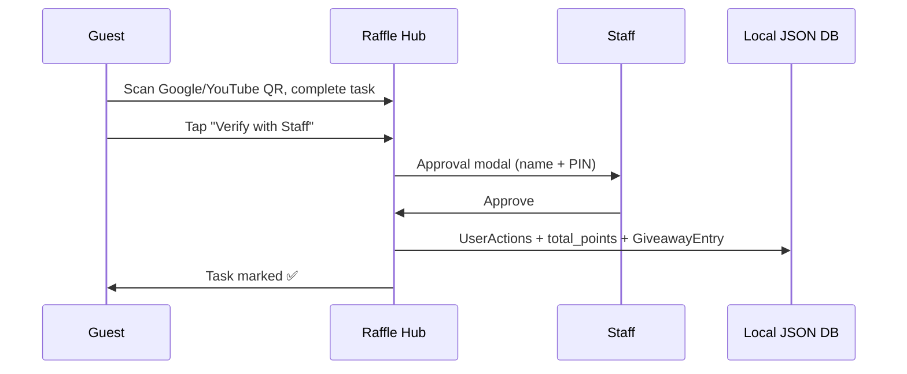

# Staff guide — VIP, points, tickets & Raffle Hub

How staff grant VIP, where data lives, and how guests earn points toward VIP unlock.

---

## Make someone VIP (Attendee Management)

**Path:** Home → **Staff Portal** → name + PIN → **Staff Dashboard** → scroll to **Attendee Management**

### Option A — Quick toggle (fastest)

1. Find the guest (search or filter **VIP Members** / **All Attendees**)
2. Click **👑+** in the **Action** column (or **👑** if already VIP)
3. Staff approval modal → pick staff name + PIN → **Approve**
4. **Grant:** sets `is_vip: true`, adds **+2 raffle entries**, logs `VIP_UPGRADE`
5. **Remove:** sets `is_vip: false`, logs `VIP_REVOKE` (entries are not removed)

### Option B — Contact detail panel

1. Click guest **Reference** or **Name** in the table
2. Detail modal shows VIP status, tickets, points, QR status
3. Click **Make VIP (+2 raffle entries)** or **Remove VIP Status**
4. Staff PIN approval → done

### Option C — Points redemption (guest earned 500+ pts)

1. Click **🎁 Redeem** on the row
2. Choose **VIP Upgrade (500 pts)** — deducts 500 points + grants VIP + bonus entries

### Option D — VIP Lounge (paid $20 upgrade at booth)

**Path:** Home → **VIP LOUNGE**

| Flow | VIP? | Points / entries |
|------|------|------------------|
| **Register VIP** (new or returning guest) | **Auto** on submit | Booth Visit **+10 pts** (once) · **+2 raffle entries** · `is_vip: true` |
| Search existing guest → **Grant VIP Status** | Staff PIN | Same as Option A (`grantVipStatus`) |

Returning guests who already have Booth Visit points do not double-earn; VIP grant is idempotent (no duplicate +2 entries if already VIP).

---

## Guest path — earn points → unlock VIP

**Path (guest):** Check in → Home → **Raffle Hub** (Giveaway icon)

After check-in, guest opens **Raffle Hub** to see:

| Task | Points | Raffle entry | Verification |
|------|--------|--------------|--------------|
| Google Review | 150 | +1 | Guest scans QR → completes review → **Verify with Staff** |
| YouTube Subscription | 150 | +1 | Guest scans QR → subscribes → **Verify with Staff** |
| Social Media Story Post | 30 | +1 | Guest tags IG → **Verify with Staff** |
| Seasoning Vote (Flavor Vote) | 50 | — | Self-serve on kiosk |
| Booth Visit (check-in) | 10 | — | Automatic on register |
| Retreat Interest | 100 | +1 | Profile or Colombia flow |

Staff taps **Verify with Staff** → enters name + PIN → points + entry applied once per action (no double-dip).

**VIP at 500 points:** Staff uses **🎁 Redeem → VIP Upgrade (500 pts)** in Attendee Management, or guest hits VIP Lounge after earning enough.

---

## Where data is stored (show laptop)

All paths below: `%AppData%\gudessence-tradeshow-app\` on Windows.

| Data | File | Key fields |
|------|------|------------|
| **Attendees** | `DB_Attendees.json` → `Contacts[]` | `contact_id`, `name`, `email`, `phone`, `is_vip`, `total_points`, `physical_tickets[]`, `flower_claimed`, `vip_popcorn_last_redeemed_at`, `guest_reference`, mobile signup fields |
| **Point action definitions** | `DB_Settings.json` → `Actions[]` | `action_name`, `points_awarded` (e.g. Google Review = 150) |
| **Completed point actions** | `DB_Engagement.json` → `UserActions[]` | `contact_id`, `action_id`, `timestamp` — prevents earning twice |
| **Raffle entries** | `DB_Engagement.json` → `GiveawayEntries[]` | `contact_id`, `giveaway_id`, `source`, `entry_time` |
| **Flavor votes** | `DB_Engagement.json` → `Votes[]` | `contact_id`, `seasoning_name` |
| **Staff audit log** | `StaffLogs.json` | `VIP_UPGRADE`, `VIP_REVOKE`, `REDEMPTION`, `RAFFLE_ADD`, etc. |
| **Backups** | `backups\backup-*.json.gz` | Full DB snapshot every ~5 min |

**Physical tickets:** 6-digit codes on `Contacts.physical_tickets[]`. Each unique ticket globally; adding one auto-adds a raffle entry. View in Attendee Management → **Total Tickets** column (click 🔍 for list).

**Points total:** Cached on contact as `total_points`; updated when actions are awarded or redemptions deduct.

---

## Attendee Management filters

| Tab | Shows |
|-----|--------|
| All Attendees | Everyone |
| VIP Members | `is_vip === true` |
| New/Inactive | Low points, few actions, not VIP |
| Engaged (Active) | Multiple actions or high points |
| Voted on Flavors | Has seasoning vote |
| Declined QR | Mobile signup declined |

---

## Staff Portal reference panel

On **Staff Dashboard**, the **Giveaway Hub — Staff Reference** card lists the same VIP perks, earn-points tasks, grand prize bundle, and staff rules that guests see on Giveaway Hub. Use it on the floor — no need to open the guest kiosk view.

---

## Raffle Hub — staff verify flow

---

## Coming next (score points page enhancements)

Standing by to extend the Raffle Hub / dedicated **Score Points** view:

- [ ] Dedicated home tile label **“Earn Points”** (alias to Raffle Hub)
- [ ] Point balance progress bar toward **500 VIP unlock**
- [ ] Guest-visible “points needed for VIP” on Profile
- [ ] Optional auto-prompt VIP redemption at 500+ pts
- [ ] Staff dashboard filter: **“Ready for VIP (500+ pts)”**

Current Raffle Hub already supports verify → points → staff redeem VIP. Say when to implement the UI polish above.

---

## Related

- [Show floor setup](../../SHOW-FLOOR-SETUP.md)
- [Architecture — data model](./architecture.md)
- [Runbook — data restore](./runbook.md)
